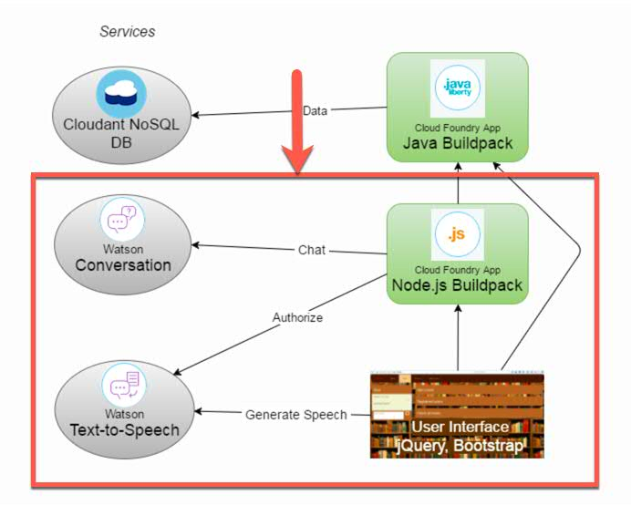
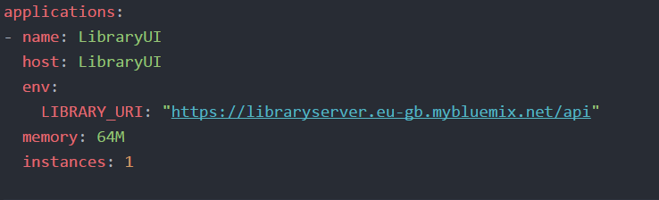

# LibraryUI

This is the second part of the Library Application: [https://github.com/florae123/LibraryApp](https://github.com/florae123/LibraryApp).

This part consists of a Node.js server and the web UI.
It is built using HTML, CSS, Bootstrap, jQuery, and a Watson Text-To-Speech Service as well as a Watson Conversation Service.

This first part is a backend server running on Java Liberty on Bluemix that connects to a Cloudant NoSQL Database.

  

## Deploy to Bluemix

1. Deploy the Java back end to Bluemix [https://github.com/florae123/library-server-java](https://github.com/florae123/library-server-java) and bind it to a Cloudant NoSQL Database.

2. Clone the app to your local environment from your terminal using the following command

    ```
    git clone https://github.com/florae123/Libraryui
    ```

3. You can find the URL of your java library server under **All Apps** on the Bluemix dashboard for the region you used. Copy the URL.

  

  

Open the file **manifest.yml** and change the "LIBRARY_URI" to the URL of your java library server and add "/api" at the end.

Change the host name *LibraryUI-[myName]* to something unique. (For example, you might replace [myName] with your name.)

    

4. Log in to your Bluemix account using the Cloud Foundry CLI tool.

	```
	cf login
	```

5. Push the app to Bluemix.

	```
	cf push LibraryUI
	```

6. Create a Watson Text-To-Speech Service and connect it to the app LibraryUI.

7. Create a Watson Conversation Service and bind it to the app. Launch, and import a workspace using the file **conversation-workspace.json**.
Copy the workspace id and replace it with the current value for *workspace_id_copy* in line 38 in **server.js**.
